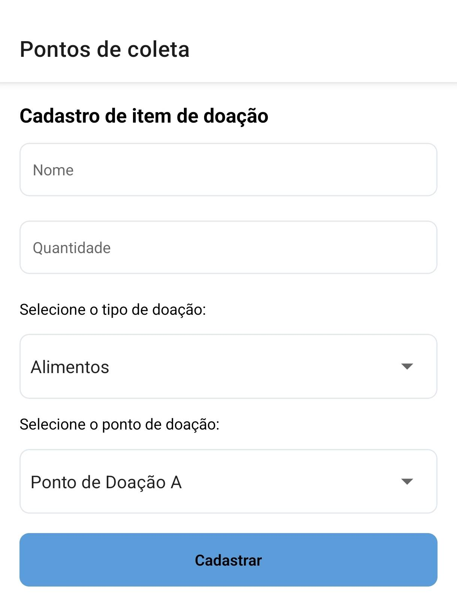
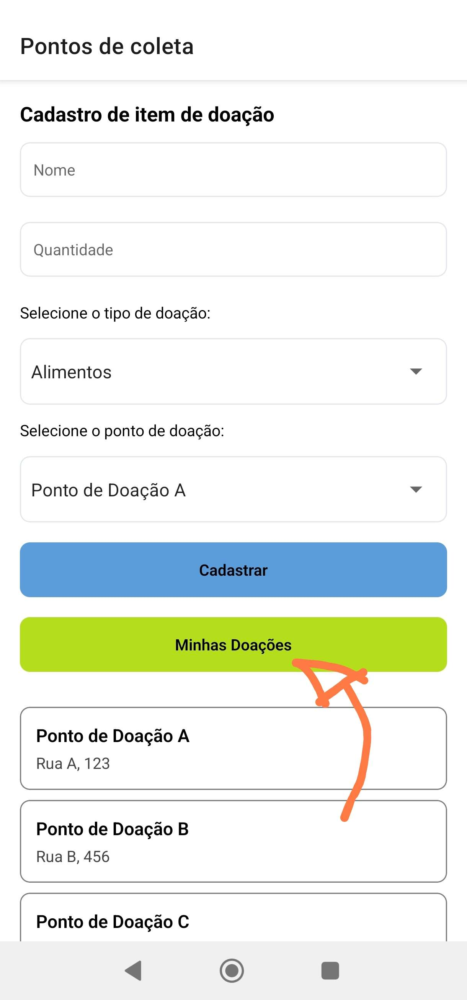
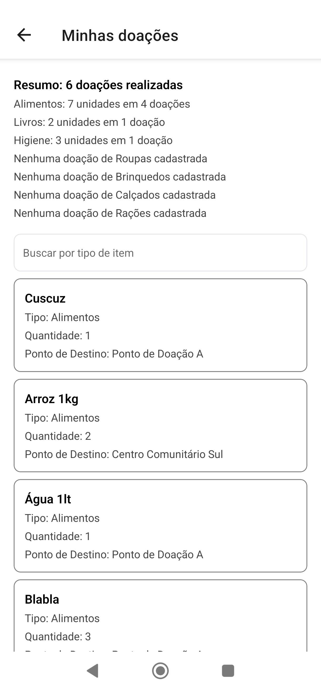
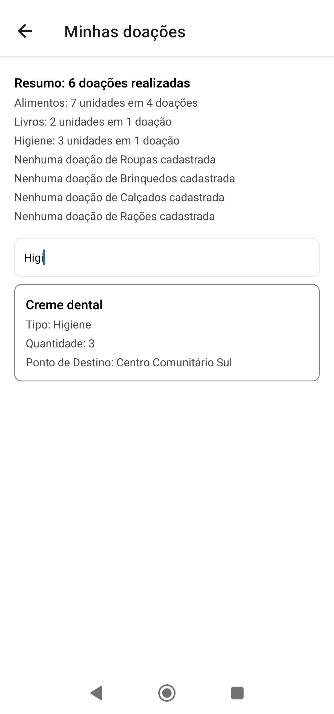
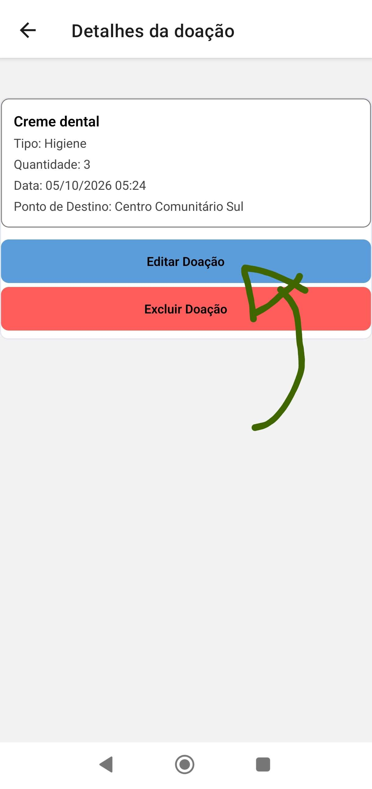
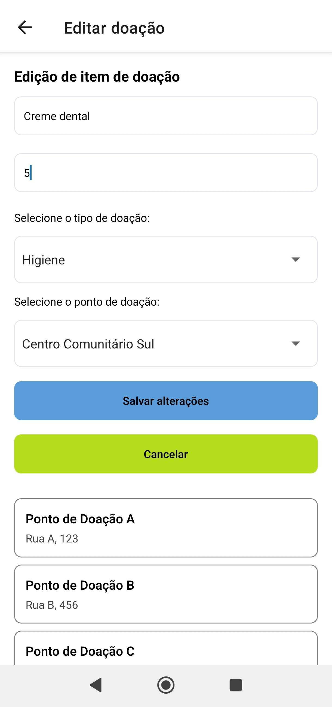
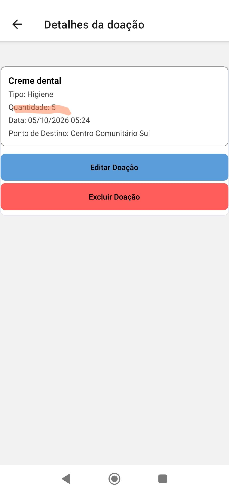
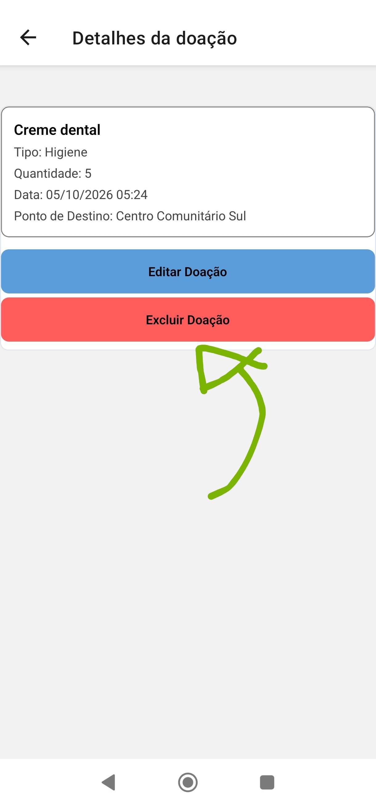
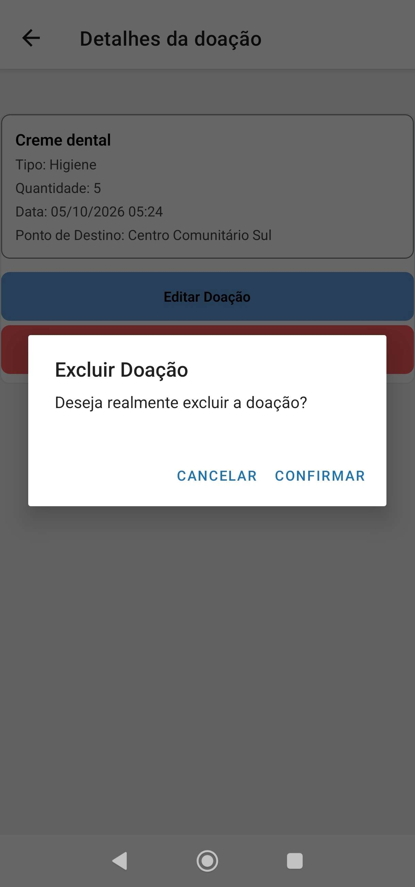
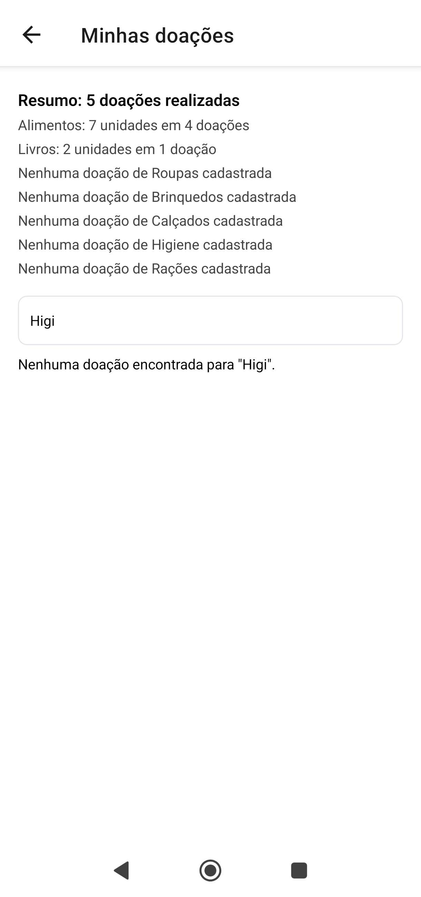

# ONG-Alimentos

## O que é?
Software desenvolvido para aprendizado, onde uma instituição fictícia (ONG Mão Amiga) precisa digitalizar as suas operações.

## Como foi desenvolvido?
Em vez da utilização do [Node.JS](https://nodejs.org/en) decidi usar [Bun](https://bun.com/) para gerenciar as dependencias, com o framework [Expo](https://expo.dev/) que utiliza de [React Native](https://reactnative.dev/) para criar aplicações multi-plataformas (Web, Android, iOS).

## Como rodar?
- Abra o terminal na raiz do projeto
- **Caso use Node.JS**:
  - npm install
  - npx expo start

- **Caso use Bun**:
  - bun install
  - bun run start

## Demonstração

1. **Registrar:** na tela inicial, informe o nome e a quantidade, escolha o tipo e o ponto de destino e toque em **Cadastrar**.

   

2. **Ver o histórico:** toque em **Minhas Doações** para abrir a lista de doações.

   

   

3. **Filtrar:** use o campo de busca para pesquisar um tipo, como "Higiene".

   

4. **Editar:** toque em uma doação, escolha **Editar Doação**, altere a quantidade e toque em **Salvar alterações**. Volte ao histórico e veja o total atualizado.

   

   

   

5. **Excluir:** abra a doação novamente, toque em **Excluir Doação** e confirme. Veja que ela desapareceu do histórico e que o resumo foi atualizado.

   

   

   
